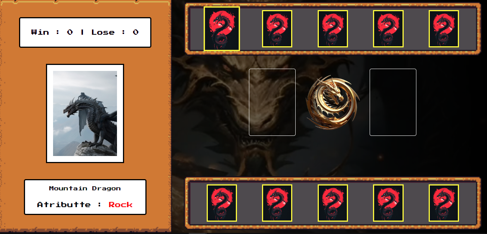
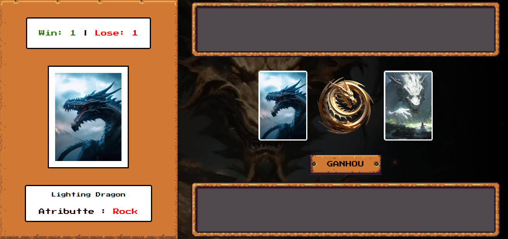
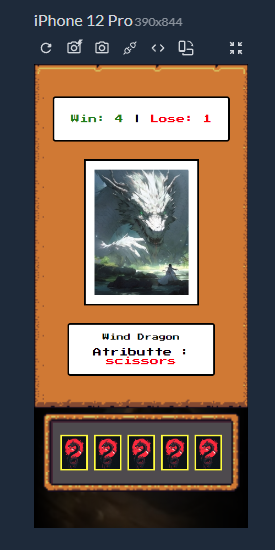

# Dragons Fight | Jo-ken-po 

Jogo de jokenpo que criei utilizando conceitos de lógica de programação aplicados a jogos

conceitos abordados:

- Armazenamento e gerenciamento de estado manual
- Funções limpas
- Organização de código

# Dragons Fight

Desenvolvi esse joguindo de Jokenpo pela última aula do bootcamp Potência Tech Ifood - Desenvolvimento de Jogos ds DIO , Usando HTML , CSS e JavaScript  

### Construído com

## Layout para Mobile 

## Como jogar 

### Rock = Pedra
### Scissors = Tesoura
### Paper = Papel

Clique na carta que escolher e espere o seu oponente, o resultado dirá se ganhou , perdeu ou empatou 
